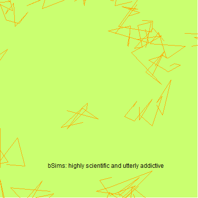

# bSims
> Bird Point Count Simulator

[](https://travis-ci.org/psolymos/bSims)
[](https://codecov.io/gh/psolymos/bSims)



## Install

```R
remotes::install_github("psolymos/bSims")
```

## Example

```R
library(bSims)

phi <- 0.5
tau <- 1:3
dur <- 10
rbr <- c(0.5, 1, Inf)
tbr <- c(3, 5, 10)

l <- bsims_init(10, 0.5, 1)
p <- bsims_populate(l, 1)
a <- bsims_animate(p, vocal_rate=phi, duration=dur)
o <- bsims_detect(a, tau=tau)
x <- bsims_transcribe(o, tint=tbr, rint=rbr)
x
## bSims transcript
##   1 km x 1 km
##   stratification: HER
##   total abundance: 98
##   total duration: 10
##   detected: 24 heard
##   1st inds. [0-3, 3-5, 5-10 min] [0-50, 50-100, 100+ m]

plot(x)

x$removal
##         0-3min 3-5min 5-10min
## 0-50m        0      1       0
## 50-100m      2      0       0
## 100+m       12      3       6
```
